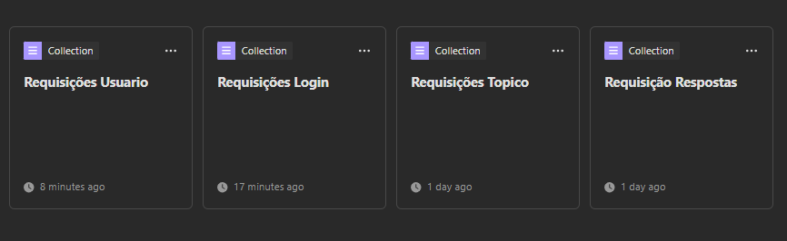
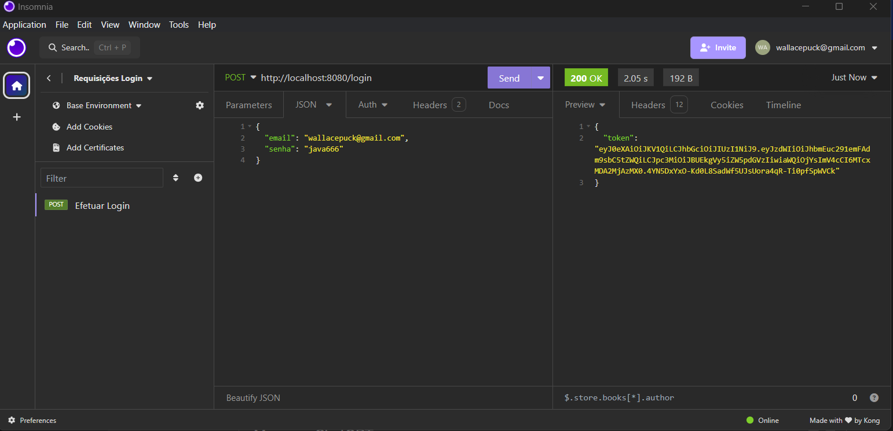
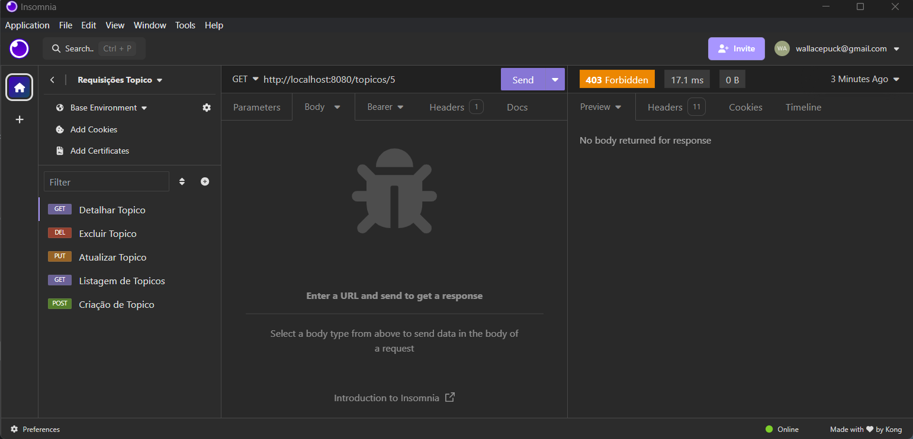
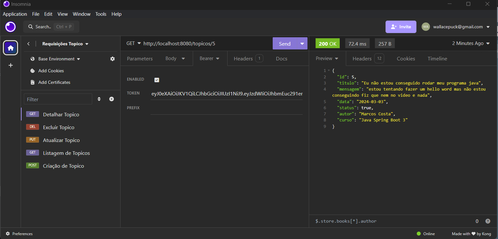
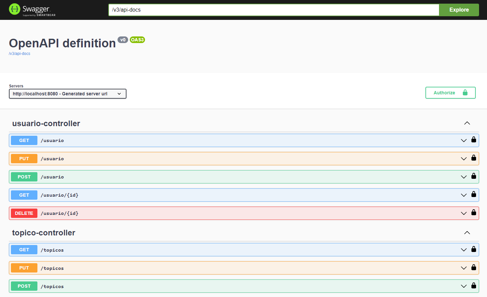
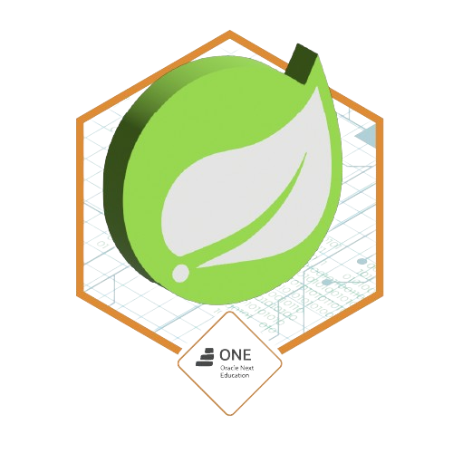

# Back-End de um Forum | ONE - Oracle Next Education | Challenge Back End Java - Forum

Situação Sprint 01: Concluído!

Situação Sprint 02: Em desenvolvimento!

## Sobre o Projeto

---

- Resultado do Challenge Back End Java da ONE - Oracle Next Education
- Criando um CRUD completo com foco somente no Beck-end
- Desafio Foi separado e 2 Partes Sprint 01 e Sprint 02
- Projeto de Estudos para aprender usar Spring Boot 3 e desenvolver uma API Rest em java

## Principais tecnologias utilizadas - Sprint 01

````
 Java - Spring Boot 3 - API Rest - Maven - MySQL 
````

### Configurações e dependencies que estou usando para cria o projeto atraves do Spring initializr
<p align="center" >
     
</p>

## Principais tecnologias utilizadas a partir do Sprint 02

````
 JSON Web Tokens - Spring Security - BCrypt - Swagger

````

## Funcionalidades
#####  CRUD - Sprint 01
- Cadastrar, Listar, Editar e Deletar Usuarios
- Criar, Listar, Editar e Deletar Topicos 
- Criar, Listar, Editar e Deletar Comentarios

#####  Autenticação e autorização via Token - Sprint 02
- Sistema só permite o acesso de uma URL através do login que
  disponibilizará um Token.
- Através do token que o usuário poderá navegar entre as URLs, sempre se autenticando através do token,  por ser um API Rest não estamos trabalhando com seções.
- Estaremos usando além do JSON Web Tokens - JWT, o Spring Security para fazer o controle de acesso e
  garantir proteções relacionadas a ataques do tipo CSRF, Clickjacking etc. 

## Imagens Previa - Sprint 01

---
- como o Foco é no Back-end, segue as imagens dos testes do CRUD pelo Insomnia
- Os mesmos teste foram feitas nas 3 entidades
<p align="center" >
     
</p>

### ♦ Teste Create
<p align="center" >
     
</p>

### ♦ Teste Read 
<p align="center" >
     
</p>

### ♦ Teste Update  
<p align="center" >
     
</p>

### ♦ Teste Delete  
<p align="center" >
     
</p>

## Imagens Previa - Sprint 02 

---
- Aplicando boas práticas na API
- Lidando com erros
- Utilizando Tokens 
- Documentação com Swagger
<p align="center" >
     
</p>

### ♦ Teste Login(Gerando Token)
<p align="center" >
     
</p>

### ♦ Teste Requisição (Sem token)
<p align="center" >
     
</p>

### ♦ Teste Requisição (Com token)
<p align="center" >
     
</p>

### ♦ Documentação (Swagger)
<p align="center" >
     
</p>

Badge pela Conclusão do Desafio
---
► https://d335luupugsy2.cloudfront.net/cms%2Ffiles%2F10224%2F1673890300Prancheta_9.png?utm_campaign=alura_latam_-_challenge_email_projeto_8_br&utm_medium=email&utm_source=RD+Station
<p align="center" >

</p>