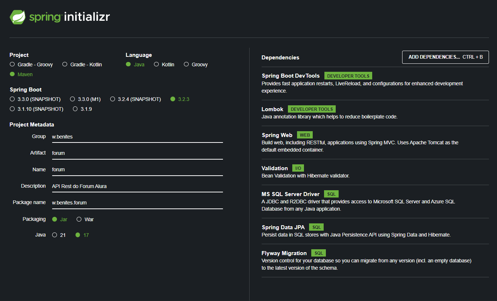
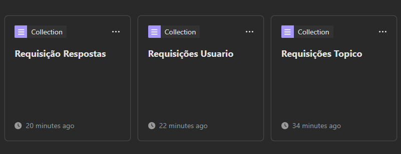
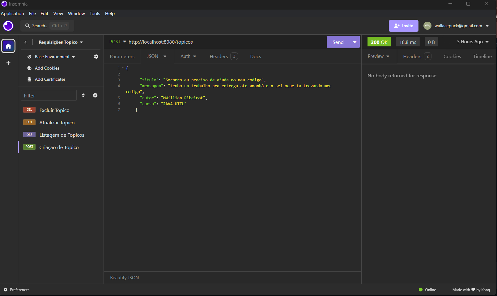
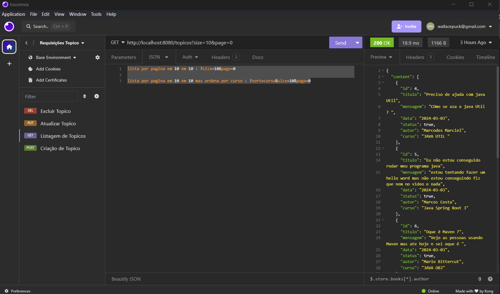
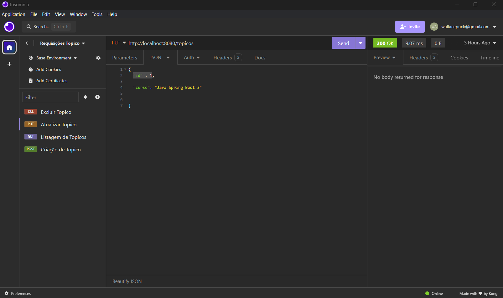
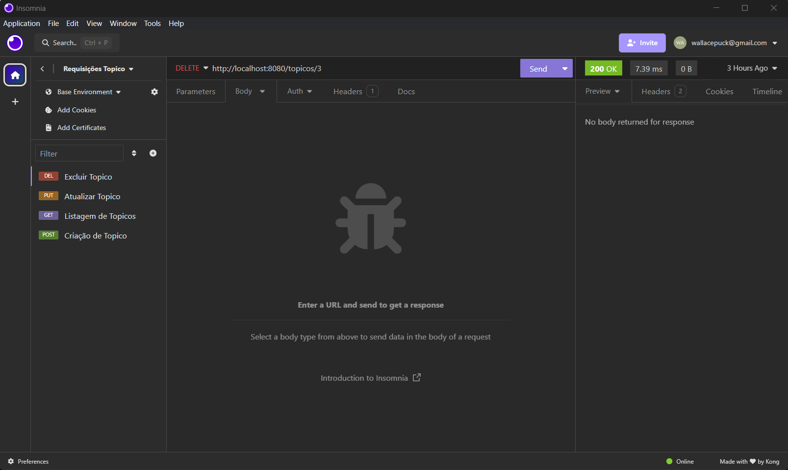

# Back-End de um Forum | ONE - Oracle Next Education | Challenge Back End Java - Forum

Situação Sprint 01: Concluído!

Situação Sprint 02: Em desenvolvimento!

## Sobre o Projeto

---

- Resultado do Challenge Back End Java da ONE - Oracle Next Education
- Criando um CRUD completo com foco somente no Beck-end
- Desafio Foi separado e 2 Partes Sprint 01 e Sprint 02
- Projeto de Estudos para aprender usar Spring Boot 3 e desenvolver uma API Rest em java

## Principais tecnologias utilizadas

````
 Java - Spring Boot 3 - API Rest - Maven - MySQL 
````

### Configurações e dependencies que estou usando para cria o projeto atraves do Spring initializr
<p align="center" >
     
</p>

## Funcionalidades
#####  CRUD 
- Cadastrar, Listar, Editar e Deletar Usuarios
- Criar, Listar, Editar e Deletar Topicos 
- Criar, Listar, Editar e Deletar Comentarios

## Imagens Previa

---
- como o Foco é no Back-end, segue as imagens dos testes do CRUD pelo Insomnia
- Os mesmos teste foram feitas nas 3 entidades
<p align="center" >
     
</p>

### ♦ Teste Create
<p align="center" >
     
</p>

### ♦ Teste Read 
<p align="center" >
     
</p>

### ♦ Teste Update  
<p align="center" >
     
</p>

### ♦ Teste Delete  
<p align="center" >
     
</p>
